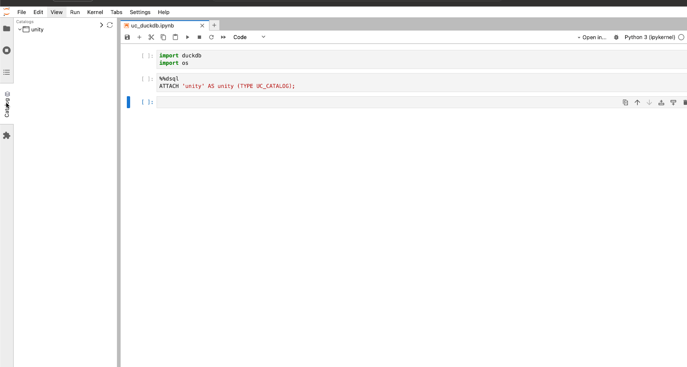

### Introducing Junity: A Unity Catalog Explorer for Jupyter Labs

I'm excited to announce the release of **Junity**, a Unity Catalog explorer for Jupyter Labs! [GitHub repo](https://github.com/dan1elt0m/junity). 

**Check out this quick demo** of Junity in action:



If you're working with the OSS Unity Catalog this extension simplifies your workflow by allowing you to
easily navigate and insert paths into your notebooks, streamlining your query-writing process.

#### Why Junity?
You don't need to have expensive Databricks clusters running to enjoy querying your data from a notebook!
Inspired by the **Databricks Notebooks Catalog Explorer**, Junity replicates much of its functionality and design.
It offers a **tree view** of your catalog, schemas, and tables, making it simple to explore your data structure.  
In addition, with Junity you can quickly insert paths like `catalog.schema.table` directly into your notebooks for efficient querying.

#### How It Works
Setting it up is super easy:

```bash
pip install junity
```

Or look for junity in the Pypi Extensions manager in Jupyter Labs.


By default, Junity looks for a Unity Catalog running at `localhost:8080`, but you can change this in the JupyterLab settings menu.


#### What's Next?
Junity supports **Unity Catalog v0.0.1** (open-source), focusing on basic functionality. 
The current version of Junity doesn't include authentication (which is expected to arrive in **Unity Catalog v0.0.2**). 
If this feature interests you, I'd love your support! **Star the repo** on GitHub if you'd like to see:
- Authentication added
- Updates to the latest OSS Unity Catalog
- Possible support for the **Databricks Unity Catalog**
- Integration with the Unity Catalog UI

#### Known Issues
- If both Jupyter Labs and Unity Catalog are running on `localhost`, you may run into **CORS** issues. 
To resolve this, you can for intance add CORS settings to Unity Catalog or set up a **reverse proxy** (using Nginx, for example). 

#### Get Involved!
I’m eager to improve Junity based on community feedback. If you have suggestions, ideas, or run into issues, please **create an issue** in the [GitHub repo](https://github.com/dan1elt0m/junity).

Let’s build something awesome together! 🚀

--- 
