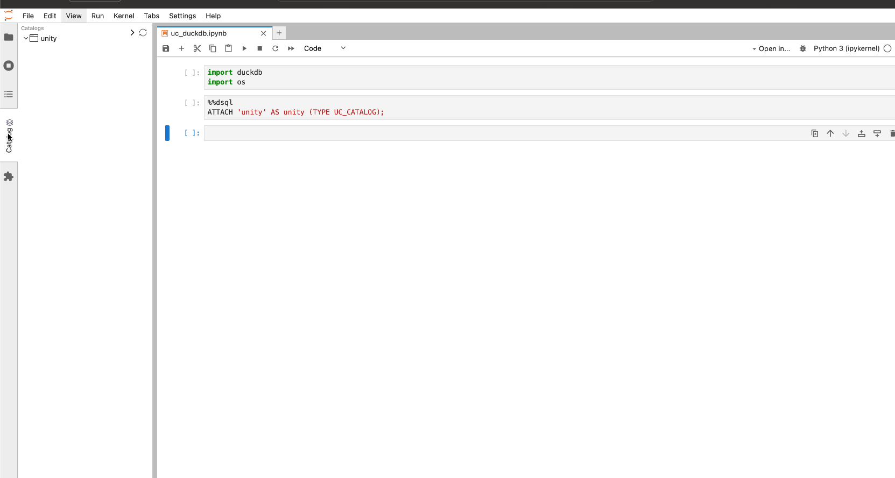

### Introducing Junity: A Unity Catalog Explorer for Jupyter Labs

I'm excited to announce the release of **Junity**, a Unity Catalog explorer for Jupyter Labs! [GitHub repo](https://github.com/dan1elt0m/junity). 

Notebooks are great for data exploration and inspired by the **Databricks Notebooks Catalog Explorer**, Junity replicates much of its functionality and design.

**Check out this quick demo** of Junity in action:



As you can see in the demo, Junity offers a **tree view** of your catalog, schemas, and tables inside a Jupyter Notebook. This makes it simple to explore your data.  
In addition, with Junity you can quickly insert paths like `catalog.schema.table` directly into your notebooks for efficient querying.

#### Why Unity Catalog?
By using the popular Unity Catalog, organizations can ensure their data is well-organized, secure, and compliant. 
Recently, Databricks Open Sourced their Catalog and thus, in theory, 
you don't need to have expensive clusters and complicated distributed ETL tools such as Spark to enjoy the benefits of Unity Catalog.
In my example, I use the simple, yet blazingly fast, DuckDB to query from the Unity Catalog. If you don't know DuckDB yet, then I highly recommend you to look it up!

#### How It Works
Setting it up is easy:

```bash
pip install junity
```

Or look for junity in the Pypi Extensions manager in Jupyter Labs.


By default, Junity looks for a Unity Catalog running at `localhost:8080`, but you can change this in the JupyterLab settings menu.
For more information about the open source Unity Catalog visit https://www.unitycatalog.io/ 

#### What's Next?
Junity supports **Unity Catalog v0.0.1** (open-source). 
The current version of Junity doesn't include authentication (which is expected to arrive in **Unity Catalog v0.0.2**). 
If this feature interests you, I'd love your support! **Star the repo** on GitHub if you'd like to see:
- Authentication added
- Possible support for the **Databricks Unity Catalog** so that you can use Jupyter Notebooks with Unity Catalog from your local laptop
- An extra Unity Catalog UI widget inside Jupyter
- Search functionality

#### Known Issues
- If both Jupyter Labs and Unity Catalog are running on `localhost`, you may run into **CORS** issues. 
To resolve this, you can  add CORS settings to the Unity Catalog server or set up a **reverse proxy** (using Nginx, for example).

#### Get Involved!
I’m eager to improve Junity based on community feedback. If you have suggestions, ideas, or run into issues, please **create an issue** in the [GitHub repo](https://github.com/dan1elt0m/junity).

Let’s build something awesome together! 🚀

--- 
